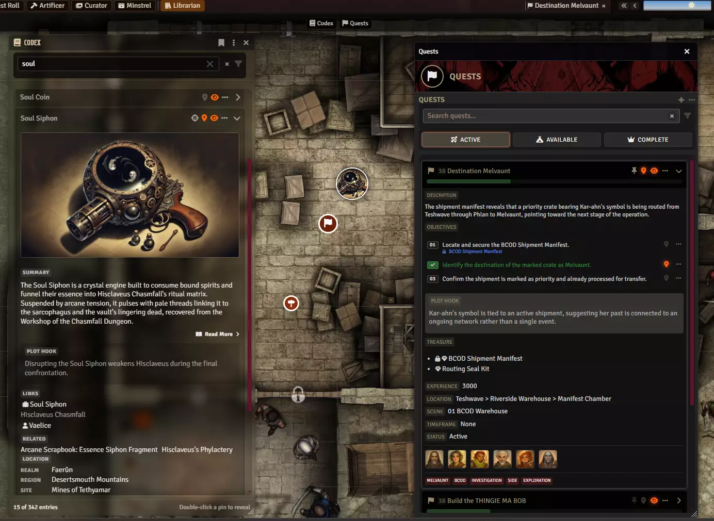

# Coffee Pub Librarian

**Audience:** Anyone using or working on Librarian.

Campaign knowledge for Foundry VTT: a codex of people, places, factions and artifacts, and
the quests that run through them. This page routes; the guides and references below carry
the detail.

Librarian is where campaign lore lives. A codex entry is a document in its own right, with
its own page subtype, data model and sheet, so entries survive as real Foundry documents
rather than as text somebody formatted in a journal. Quests sit alongside them, tracked by
objective and pinned to the canvas.

Requires [Coffee Pub Blacksmith](https://github.com/Drowbe/coffee-pub-blacksmith), which
supplies the window chrome, canvas pins, the shared tag vocabulary and the compendium
resolver.

## For players and GMs

- [Getting started](userguides/userguide-getting-started.md) -- what appears when you enable
  the module, and the first things to do with it.
- [The codex](userguides/userguide-codex.md) -- adding and finding entries, how they link to
  each other, and who sees them.
- [Quests and objectives](userguides/userguide-quests.md) -- creating quests, moving
  objectives along, and quest states.
- [Importing and exporting](userguides/userguide-importing.md) -- bringing existing campaign
  notes in without retyping them.
- [Canvas pins](userguides/userguide-canvas-pins.md) -- putting entries, quests and
  objectives on the map.
- [What players see](userguides/userguide-player.md) -- what your table can and cannot look
  at.
- [Running a session](userguides/userguide-gm.md) -- the GM's workflow, in session order.
- [Settings](userguides/userguide-settings.md) -- every setting and what changing it does.

## For developers

- [Codex architecture](architecture/architecture-codex.md) -- the declared page subtype, where entry data
  lives, and why the export refuses to write a partial.
- [Quest architecture](architecture/architecture-quests.md) -- how quests are stored, how canvas pins are
  built from them, and the reader and writer contract.

## Known issues

- [Known issues](known-issues.md) -- defects that have not been fixed yet, and their
  workarounds.
